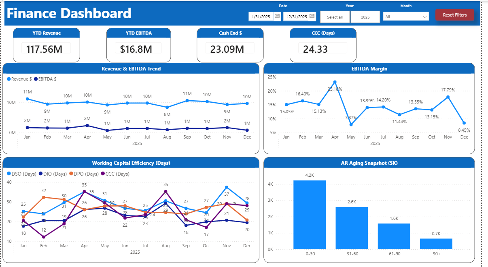
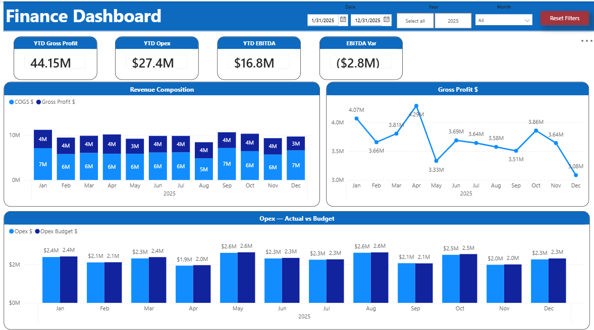
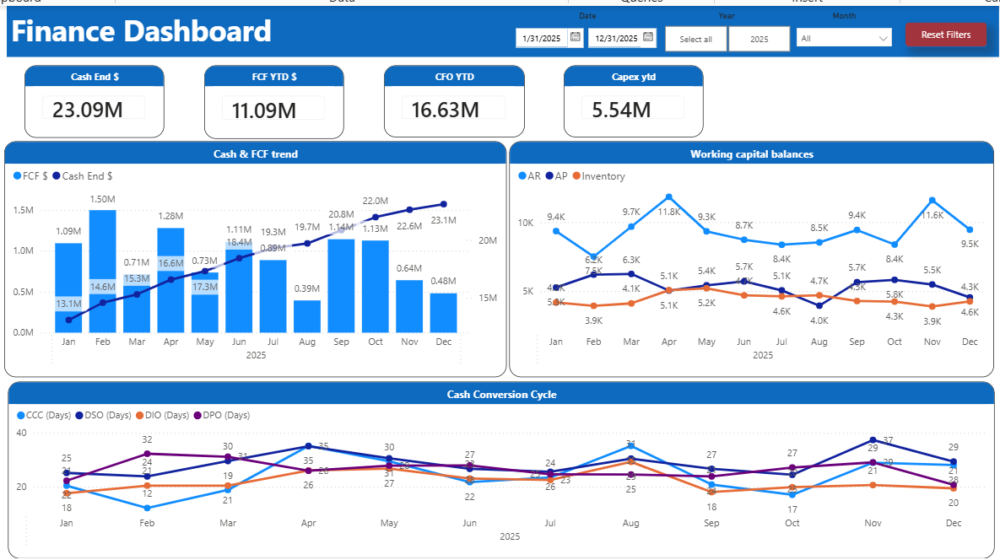

# Finance Dashboard – Executive Finance & CFO Reporting (Power BI)

An executive-level finance analytics solution built in **Power BI** to support CFOs and senior leadership with clear, actionable financial insights.

This dashboard consolidates **profitability, cash flow, budget vs actual performance, and working capital metrics** into a single executive view — enabling faster, data-driven strategic decisions without requiring deep financial analysis.

---

## ⚠️ Data Disclaimer

This project uses **synthetic (dummy) data** created solely for portfolio and demonstration purposes.  
No real, confidential, or client data is included.

---

# 📊 Dashboard Screenshots

## 1️⃣ Executive Summary
High-level financial health overview including Revenue, EBITDA, Cash Position, Working Capital, and Budget vs Actual performance drivers.



---

## 2️⃣ Profitability Analysis
Detailed breakdown of Revenue, COGS, Gross Margin, Operating Expenses, and EBITDA performance against budget.



---

## 3️⃣ Cash & Working Capital
Liquidity-focused view tracking Cash Balances, Free Cash Flow, CapEx, and working capital components (AR, Inventory, AP).



---

## 4️⃣ AR & Collections
Accounts Receivable aging, DSO trends, and collections risk indicators to improve cash conversion cycle.


---

# 🧮 Key Metrics & KPIs

- Revenue (YTD)
- EBITDA & EBITDA Margin
- Cash Balance
- Free Cash Flow (FCF)
- Budget vs Actual Variance
- Gross Margin %
- Operating Expense Ratio
- Working Capital Metrics:
  - DSO (Days Sales Outstanding)
  - DIO (Days Inventory Outstanding)
  - DPO (Days Payable Outstanding)
  - CCC (Cash Conversion Cycle)
- Accounts Receivable Aging Buckets

---

# 🛠️ Technical Implementation

- **Power BI Desktop**
- Advanced **DAX measures**
  - Time intelligence (YTD, MoM, variance)
  - Financial KPI calculations
  - Margin & ratio analysis
- Data modeling best practices (star schema design)
- Executive-focused UX & storytelling
- Custom JSON theme for consistent CFO-style branding

---

# 🎯 Business Value

This dashboard enables leadership to:

- Identify profitability drivers
- Monitor budget variance in real time
- Improve working capital efficiency
- Reduce collections risk
- Strengthen cash flow visibility

Designed to replicate real-world CFO reporting environments.

---

# 📁 Repository Structure

```text
finance-dashboard/
│
├── data/
│   └── finance_data.xlsx
│
├── dax/
│   └── Finance_dashboard_Measures.dax
│
├── theme/
│   └── finance_dashboard_theme.json
│
├── screenshots/
│   ├── Finance_Dashboard_P1.png
│   ├── Finance_Dashboard_P2.png
│   ├── Finance_Dashboard_P3.png
│   └── Finance_Dashboard_P4.png
│
├── LICENSE
└── README.md
